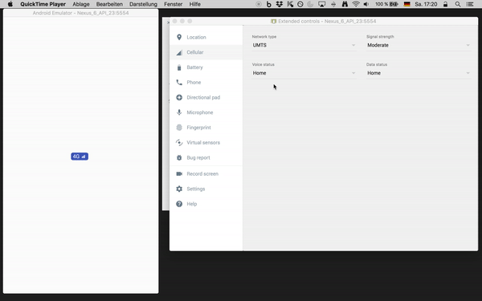

NetStatusView
=======

# About

[](https://travis-ci.org/XinyueZ/net-status-view)

A banner-view which can show strength of network according to different levels. 

- Wifi
- 2G, 3G, 4G, unknown.
- 4 Strength-levels, 0~3
- No needs requiring *location-permission* or other dangerous permissions.

# Usage

- *Android Things*. There's no status-bar on this android variant. For Android apps based on Android Things should use this view to indicate network status intuitively.
- *TV apps*. Like Android Things there's no status-bar for status of network.
- *Full-Screen apps with camera*. Common camera-based apps are full screen, so it is necessary to provide a network status interface, especially online video or stream apps.

# Use




```xml

    <!--Declaration of permissions-->
    <uses-permission android:name="android.permission.READ_PHONE_STATE"/>
    <uses-permission android:name="android.permission.ACCESS_WIFI_STATE"/>
    <uses-permission android:name="android.permission.ACCESS_NETWORK_STATE"/>
    
    <!--layout-->
    <library.view.lib.NetStatusView
        android:id="@+id/network_status_banner"
        style="@style/NetStatusViewStyle"
        app:strengthLevelResIds="@array/ic_net_strength_levels"
        app:text2G="@string/net_status_2g"
        app:text3G="@string/net_status_3g"
        app:text4G="@string/net_status_4g"
        app:textStatusColor="@color/ns_view_text_color"
        app:textStatusSize="@dimen/ns_view_text_size"
        app:textUnknown="@string/net_status_unknown"
        app:textWifi="@string/net_status_wifi"/>
        
    <!--All attributes have default resources in the library.-->    
        
        
    <!--befine some styles-->
    <style name="NetStatusViewStyle">
        <item name="android:layout_width">wrap_content</item>
        <item name="android:layout_height">20dp</item>
        <item name="android:paddingRight">5dp</item>
        <item name="android:paddingLeft">5dp</item>
        <item name="android:paddingStart">5dp</item>
        <item name="android:paddingEnd">5dp</item>
        <item name="android:background">@drawable/bg_ns_view</item>
        <item name="android:layout_marginTop">6dp</item>
        <item name="android:layout_marginEnd">6dp</item>
        <item name="android:layout_marginRight">6dp</item>
    </style>
    
    <!--background-->
    <shape xmlns:android="http://schemas.android.com/apk/res/android"
          android:shape="rectangle">
       <corners
           android:radius="5dp">
       </corners>
       <solid android:color="@color/ns_view_background"/>
    </shape>     
    
    <!--background-color-->
    <color name="ns_view_background">@color/colorPrimary</color>
        
    <!--indicators, if you want to -->
    <integer-array name="ic_net_strength_levels">
        <item>@drawable/ic_net_strength_level_1</item>
        <item>@drawable/ic_net_strength_level_2</item>
        <item>@drawable/ic_net_strength_level_3</item>
        <item>@drawable/ic_net_strength_level_4</item>
    </integer-array>
    
    
    <!--labels for 2G -4G, unknown-->
    <string name="net_status_wifi">Wifi</string>
    <string name="net_status_2g">2G</string>
    <string name="net_status_3g">3G</string>
    <string name="net_status_4g">4G</string>
    <string name="net_status_unknown">No Net</string>
    
    <!--label text-size-->
    <dimen name="ns_view_text_size">14sp</dimen>
    
   <!--label text-color-->
   <color name="ns_view_text_color">#FFFFFFFF</color>
```

# License

                                MIT License

                    Copyright (c) 2018 Chris Xinyue 

    Permission is hereby granted, free of charge, to any person obtaining a copy
    of this software and associated documentation files (the "Software"), to deal
    in the Software without restriction, including without limitation the rights
    to use, copy, modify, merge, publish, distribute, sublicense, and/or sell
    copies of the Software, and to permit persons to whom the Software is
    furnished to do so, subject to the following conditions:
    
    The above copyright notice and this permission notice shall be included in all
    copies or substantial portions of the Software.
    
    THE SOFTWARE IS PROVIDED "AS IS", WITHOUT WARRANTY OF ANY KIND, EXPRESS OR
    IMPLIED, INCLUDING BUT NOT LIMITED TO THE WARRANTIES OF MERCHANTABILITY,
    FITNESS FOR A PARTICULAR PURPOSE AND NONINFRINGEMENT. IN NO EVENT SHALL THE
    AUTHORS OR COPYRIGHT HOLDERS BE LIABLE FOR ANY CLAIM, DAMAGES OR OTHER
    LIABILITY, WHETHER IN AN ACTION OF CONTRACT, TORT OR OTHERWISE, ARISING FROM,
    OUT OF OR IN CONNECTION WITH THE SOFTWARE OR THE USE OR OTHER DEALINGS IN THE
    SOFTWARE.